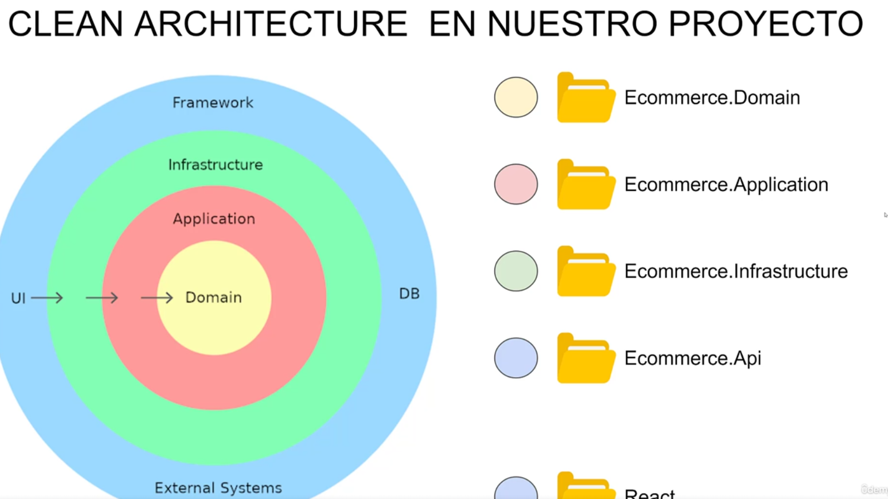

# Amazon-Ecommerce

## Información General

Versión de .NET 7.0 SDK 
## Indice

# Clean Architecture en este proyecto

1. Domain: Entidades del negocio
2. Application: Reglas de negocio (Interfaces, DTO Models, ViewModels, Excepciones)
3. Implementación Interfaces, Definición DBContext con EntityFramework
4. Framework, Database, UI, External Systems 

- ORM
- 

## Conceptos y herramientas utilizados.

- Git.